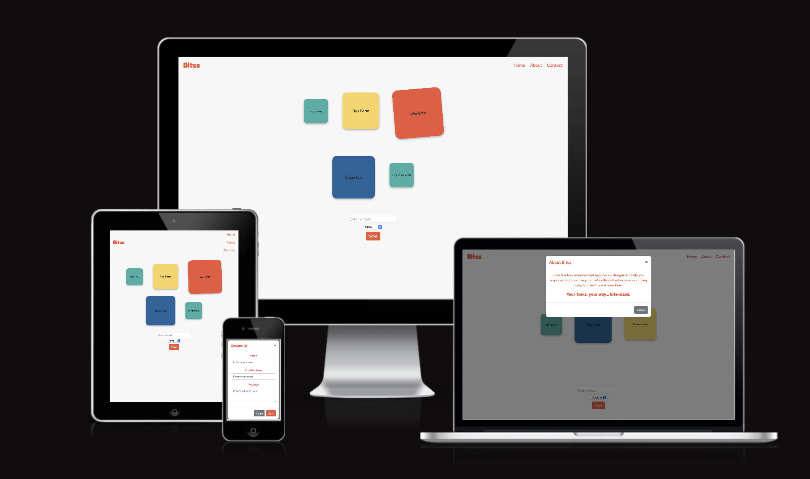

# Bites - Task Management Application

Bites is designed with neurodiversity in mind, offering a simple and intuitive approach to task management that helps reduce cognitive overload. Unlike busy, energy-draining apps, Bites uses a clean, minimal interface with bite-sized, color-coded task squares to make prioritising and organising tasks straightforward and stress-free. By focusing on clarity and ease of use, Bites helps users stay productive without feeling overwhelmed, so you can manage your day with more focus and less effort. It’s task management made to fit your flow, not disrupt it.The application is built using HTML, CSS (Bootstrap), and JavaScript.

You can check out the deployed project [here](https://amylour.github.io/bites/).

## Features

- Create tasks with different sizes.
- Store tasks in local storage.
- Display tasks on page load.
- Modal alert for task limits.

## Code Overview

- **Task Creation**: Allows users to create tasks with different sizes and store them in local storage.
- **local Storage**: Tasks are stored in local storage and reloaded on page load.
- **Modal Alert**: Displays a modal alert when task limits are reached.

## UX Design

